# Bojové lode a technika boja

* TOC
{:toc}

Boj v hre Outspace vedú zvyčajne hráči proti [Zlu](https://source.outspacegame.com/cs/svet/zlo/). Bojovať proti lodiam a staniciam iných hráčov či NPC je technicky možné, avšak aktuálne sa dodržiava nepísané pravidlo, že neútočíme.

Základnú bojovú loď je možné postaviť relatívne skoro z modulov, ktoré sa dajú kúpiť na NPC staniciach za prijateľné ceny. Zo začiatku bude loď malá a pomerne slabá, avšak na tréning boja s malými nepriateľmi úplne dostačujúca. Časom si hráči pomaly lode vylepšujú, pridávajú nové a lepšie moduly a zvládnu poraziť takmer všetko.

Tento návod je určený novým hráčom, aby im pomohol postaviť a neskôr vylepšiť základnú bojovú loď postavenú na AMTR platforme. S takouto loďou je možné ničiť prakticky akékoľvek zlo, okrem [Leviatana](https://source.outspacegame.com/cs/svet/zlo/list/20/), čo väčšine hráčom vystačí na dlhé mesiace. Neskôr, keď už hráči získajú skúsenosti, vybavenie a peniaze, nie je problém prejsť aj na väčšie lode.

> **Dobrá rada nad zlato:**  
> Po vstupe do zóny vás určite uchvátia obrovské bojové lode, ktorými skúsení hráči zabijú na počkanie všetko živé v okolí. Sú to lode postavené na platformách CMTR, prípadne HLO. Budete mať nutkanie takú loď okamžite vlastniť a vládnuť s ňou vesmíru, čo v zóne nie je problém.  
> **NEROBTE TO!!!**

Veľké bojové lode majú svoj význam, ale majú aj obrovské nevýhody:

- sú strašne ťažké – len samotné otáčanie na mieste trvá celé minúty
- sú pomalé – kým sa rozbehnú na warpovú rýchlosť, stihnete osláviť dvoje narodeniny (ok, možno len jedny)
- na plne vybavenú HLO loď budete potrebovať vyššie desiatky (!!) dobre vytrénovaných astronautov
- samotný boj nie je taký zábavný ako s malými a rýchlymi loďami

---

## Stavba prvej bojovej lode

Prvú bojovú loď postavíme na platforme AMTR. Všimnite si, že v Source sú všetky moduly, ktoré budeme používať, otagované značkou **„obrnený“**. Na bojovú loď nedávajte **žiadne** moduly, ktoré nie sú obrnené.

Prichádzajúci útok od nepriateľov sa náhodne rozdeľuje na jednotlivé moduly lode a odpočítava im body zdravia (HP). Akonáhle sa **ktorýkoľvek** modul dostane na úroveň 0 HP (čiže bol zničený), **prišli ste o celú loď, vrátane nákladu a posádky**. Aj keď túto skúsenosť je celkom poučné zažiť, mali by ste tušiť, prečo sa to stalo.

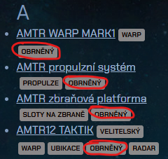

> **Dobrá rada:**  
> V [zozname modulov](https://source.outspacegame.com/cs/kosmicka-lod/moduly/list/) na Source je možné myškou kliknúť na ktorýkoľvek tag (značku) pri niektorom z modulov a zobrazí sa vyfiltrovaný zoznam len tých modulov, ktoré majú priradenú túto značku.

### Moduly

- **Veliteľský modul:**  
  AMTR12 TAKTIK – základný ľahký modul, s ktorým dokážete vydržať celé mesiace bez nutnosti upgradu.

- **Pohon:**  
  Základný AMTR pohon – ľahký, ale obrnený, taktiež na dlhé mesiace úplne postačujúci.

- **Warp:**  
  AMTR MARK1 – nalož iba toľko, aby si vedel warpovať. Bojovou loďou nevozíš náklad, takže nepotrebuješ žiadnu rezervu.

- **Zbraňové platformy:**  
  Samozrejme AMTR. Nakúp toľko, koľko dokážeš vyzbrojiť a obsadiť posádkou (do každého modulu idú *dvaja* astronauti). Začni s menším počtom (radšej kúp a osaď lepšie zbrane), postupne budeme pridávať. Na začiatok je úplné minimum 2 kusy.

- **Batériové moduly:**  
  Aktuálne v hre Outspace *neexistujú* obrnené batériové moduly. Navyše, na bojovej lodi sú aj tak zbytočné. Batériové (a vlastne už žiadne iné) moduly na bojovú loď **nedávaj**.

### Zbrane a zbraňové platformy

#### Vyzbrojenie zbraňových platforiem

Vyzbrojenie zbraňových platforiem je veda a umenie zároveň. Každému sa páči niečo iné, respektíve preferuje inú taktiku boja. Nižšie popisujem moje vyzbrojenie, s ktorým zvládam boj s takmer akýmkoľvek zlom okrem Leviatana.

Na *prvú* zbraňovú platformu daj *na obe strany* [Gatlingy](https://source.outspacegame.com/cs/kosmicka-lod/palubni-zbrane/list/3/), ktoré budeš mať takmer neustále (až na malé výnimky) prepnuté do C-M (counter missiles) módu, v ktorom *úplne automaticky* zostreľujú rakety vypálené na tvoju loď. Rakety strieľajú Golemovia a Strážcovia. Platí to aj pre Svetlušky (Fireflies) vypustené Strážcom, ktoré sa v blízkosti lode premenia na projektily. V tomto štádiu ich vedia Gatlingy zničiť.

Na *všetky ostatné* zbraňové platformy nainštaluj *na obe strany* čo najsilnejšie lasery. Kráľom laserov je [THEL4 Quadplex](https://source.outspacegame.com/cs/kosmicka-lod/palubni-zbrane/list/13/) s dostrelom až 30km, ktorý sa dá pomerne ľahko kúpiť na NPC staniciach. Ak Quadplex nevieš zohnať, prípadne nemáš dosť peňazí, riešenie je ľahké – zober THEL2 alebo aj základný THEL a časom vymeníš za lepší.

#### Posádka zbraňových platforiem

Zbrane obsluhuje posádka – astronauti. Od nich závisí to, či zbraň dokáže cieľ zamerať a trafiť, ale aj ako rýchlo to dokáže opakovať. Do bojových lodí odporúčam dávať čo najlepšie vytrénovaných astronautov (minimálne na úroveň limitu TES zbraňovej platformy).

Do každej AMTR platformy idú dvaja astronauti, každý ovplyvňuje inú charakteristiku streľby. Z jedného astronauta využije platforma max. 15 bodov *taktického* modifikátora a z druhého max. 15 bodov *inžinierskeho* modifikátora.

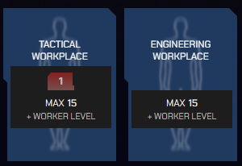

Ak platformu obsadíte astronautami s *vyššími modifikátormi*, skóre prevyšujúce limit platformy (čiže 15) sa bude ignorovať. V nasledovnom príklade som osadil platformu astronautom s T = 31 a druhým astronautom s E = 17, avšak platforma využila z oboch modifikátorov iba 15 bodov, čo je jej maximum.

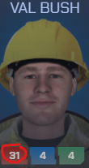
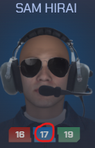

- **Taktický modifikátor:** ovplyvňuje presnosť mierenia, a teda pravdepodobnosť zásahu nepriateľa.
- **Inžiniersky modifikátor:** ovplyvňuje rýchlosť nabíjania, a teda schopnosť zbrane páliť viackrát za určitú časovú jednotku.

---

## Vylepšenia do budúcnosti

Ak dokážeš postupne osadiť loď cca. *siedmimi* AMTR platformami, s takto vybavenou loďou môžeš hrať hru dlhé mesiace bez nutnosti čokoľvek meniť. Loď bude relatívne rýchla a na väčšinu nepriateľov dostatočne silná. Ak ju však napriek tomu budeš chcieť vylepšiť (ešte stále na báze AMTR), mám pár nápadov:

- AMTR WARP MARK1 má pomerne málo „zdravia“ (len 250 HP bodov), preto pri zásahoch zvykne byť poškodený viac ako ostatné moduly. Ak dokážeš uloviť signál a vyrobiť si napr. [TransPlan Chronograph](https://source.outspacegame.com/cs/kosmicka-lod/moduly/list/73/), výrazne si polepšíš. Chronograph síce nie je oficiálne obrnený modul, ale má až 450 HP a podľa vlastných skúseností pomerne veľa vydrží.

- Pohon AMTR je na začiatok výborný, avšak neskôr (keď osadíš viac zbraňových platforiem) už bude rozbeh otravne pomalý. Vtedy odporúčam stiahnuť signál, vyrobiť a osadiť buď pohon [ATLAS](https://source.outspacegame.com/cs/kosmicka-lod/moduly/list/64/) od UAA, alebo rovno [HLO CMTR](https://source.outspacegame.com/cs/kosmicka-lod/moduly/list/63/) (áno, vieš osadiť na AMTR loď napriek tomu, že má iný typ konektorov).

- Na jednu stranu lode osadíš namiesto laserov napr. [Titánové rakety](https://source.outspacegame.com/cs/kosmicka-lod/palubni-zbrane/list/4/). Primárne budeš nepriateľa zameriavať lasermi, rakety vedia vypáliť a naviesť sa na cieľ *aj z odvrátenej strany lode*!

---

## Taktika boja

Boj sa môže zdať na začiatku neskutočne ťažký a nevyrovnaný, pričom netušíš, ako sa vlastne máš postaviť, otočiť atď. Nezúfaj, po tomto návode to bude hračka.

### Taktický pohľad

Na začiatku len vydokuj zo stanice, kde natrénujeme základné pohľady a operácie s loďou:

1. Vydokuj zo stanice (klávesa `Esc`).
2. Prepni sa do taktického pohľadu (klávesa `Tab`). Objaví sa niečo ako „hologram“ (alebo model) tvojej lode, ktorý ostane vždy rovnako veľký, aj keď meníš priblíženie kamery. Ak model nevidíš, použi klávesu `K`.
3. Stláčaj opakovane `Tab`, prípadne klávesy `+` a `-` na alfanumerickej klávesnici, alebo toč kolieskom myšky dovtedy, kým neuvidíš celý taktický terč:

   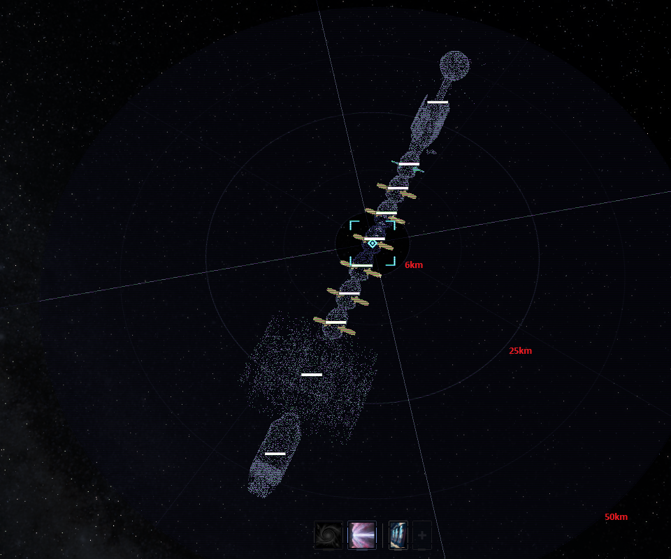

   Na terči sú vyznačené približné vzdialenosti od lode.

   Vyskúšaj si:

   - točiť kolieskom myšky pre zmenu priblíženia
   - držať *pravé* tlačidlo myšky a pohybom myši otáčať kameru

4. Otvor radar (klávesa `R`).

Toto je základný taktický pohľad, ktorý by si mal používať počas boja, kde vidíš všetko potrebné a vieš jednoducho ovládať kameru, pohyb svojej lode a jej zbrane.

### Režimy zbraní

Každá zbraň má niekoľko režimov, medzi ktorými ich vieš počas boja prepínať. Režim konkrétnej zbrane prepneš tak, že na ňu klikneš *ľavým* tlačidlom myšky. Zbrane majú tieto základné režimy:

- **Manuálny režim:**  
  Zbraň je prakticky deaktivovaná a vystrelí až vtedy, keď na danú zbraň klikneš ľavým tlačidlom myšky. Režim sa používa najmä vtedy, ak nechceš danou zbraňou páliť (napr. je zbytočné míňať rakety a torpéda na nepriateľov typu Imp alebo Dagon). Zbraň v tomto režime má na sebe krížik (ak nie je pripravená strieľať) alebo kosoštvorec (ak je pripravená strieľať).

- **Automatický režim:**  
  Zbraň v tomto režime automaticky zameriava a páli. Pozor, každá zbraň má povolený palebný uhol, ktorý ak prekročíš, zbraň strieľať **nebude**. Zbrane v tomto režime sú sfarbené do *hneda*, ak je zameraný cieľ na dostrel (alebo ak nie je zameraný žiadny cieľ), inak sú sfarbené do *červenej* farby.

- **C-M:**  
  Counter-Missile (čiže protiraketový režim) – majú len niektoré zbrane, v našom prípade Gatling. Zbrane prepnuté do tohto režimu sú sfarbené *namodro*.

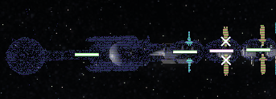

Na tomto obrázku je pár Gatlingov osadených na prvej platforme (na oboch stranách) prepnutý do *režimu C-M*, nasleduje pár THEL4 Quadplex laserov, ktoré sú v *manuálnom režime* a úplne vpravo je pár THEL4 Quadplex laserov v *automatickom režime*.

**Štandardne** sa do boja vyráža s Gatlingami prepnutými do C-M režimu a ostatnými lasermi v automatickom režime.

### Prvý boj

Na úplne prvý boj je ideálne nájsť si stanicu, na ktorej je prilepený *parazit*. Ten totiž nemá zbrane a nevie strieľať. Alternatívou je otvoriť radar a nájsť **osamoteného** Impa, prípadne Démona. Prekontroluj si na radare aj iných najbližších nepriateľov, že sú minimálne 300km ďaleko od tvojej budúcej obete. Na prvý cieľ chceš mať kľud a priestor.

> **Dobrá rada:**  
> Ak klikáš na radare na jednotlivé objekty, tvoja kamera sa vždy automaticky vycentruje na daný objekt. Je to fajn, ale pri boji je takáto zmena kamery to posledné, čo potrebuješ.  
> Ak ale na radare klikneš na objekty **so stlačenou klávesou `Shift`**, kontextové okno sa otvorí rovnako ako bez `Shift`, avšak *kamera sa ani nepohne*.

Postup:

1. Ak máš vyhliadnutý cieľ, vydokuj zo stanice a *nastav si taktický pohľad* podľa príslušnej kapitoly vyššie.
2. Skontroluj si režimy zbraní: Gatlingy v C-M, lasery v automatickom režime.
3. Klikni na radare na tvoj cieľ a zvoľ *priblíženie na vzdialenosť*.  
   Pomocou posuvníka nastav prílet na vzdialenosť cca. 15–20km a potvrď let.

   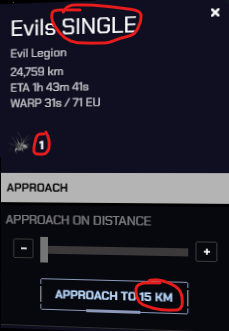

4. Pravým tlačidlom myšky otoč pohľad tak, aby tvoja loď smerovala nahor (na kompase by letela na sever).
5. Akonáhle dosiahneš warpovú rýchlosť, zapni warp a na radare sleduj tvoj cieľ (preskroluj úplne nahor, pretože po prílete to bude tvoj najbližší objekt).

   > **UPOZORNENIE:** Priblíženie na vzdialenosť je vždy len *približné*!!
   > Môžeš byť príliš blízko alebo príliš ďaleko od cieľa. Ak si viac ako 25km,
   > vráť sa na stanicu a skús to znova.

6. Po prílete máš času dosť, ale existuje šanca, že ti nepriateľ loď poškodí alebo aj zničí. Preto sa hneď pusti do boja:

   - Zameraj cieľ jedným z nasledovných spôsobov:
     - Priamo v taktickom pohľade klikni na nepriateľa *pravým tlačidlom* myšky a zvoľ **Zamieriť**:

       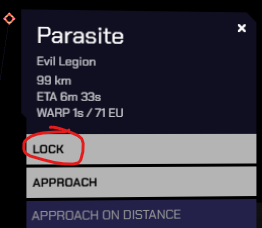

     - V radare klikni na nepriateľa (ideálne so stlačenou klávesou `Shift`) a z kontextového menu zvoľ **Zamieriť**:

       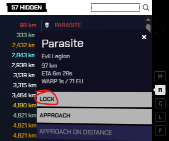

     - Stlač klávesu `N`, ktorá automaticky zameria 3 najbližšie ciele do vzdialenosti 300km. Tu len hrozí, že zameriaš náhodný cieľ niekde ďaleko, ktorý sa „priplietol“ do vášho boja.

   - Zameraný cieľ sa objaví na ľavej strane obrazovky, je zvýraznený červenou farbou na radare a aj priamo v taktickom pohľade:

     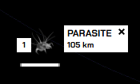
     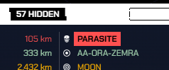
     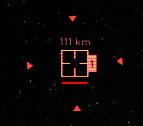

   - Na ktorúkoľvek zbraň (na holograme lode v taktickom pohľade) **klikni kolieskom myšky**. Loď sa automaticky natočí tak, aby mali zbrane čo najlepší uhol a pokiaľ sú prepnuté v automatickom režime, začnú páliť.
   - Počkaj, kým nepriateľa nezničíš.
   - Prileť na svoju stanicu, zadokuj, otvor hangár a **oprav** prípadné poškodenia lode.

### Práca s cieľmi

Je **veľmi dôležité** rozumieť a vedieť rozlišovať medzi cieľmi, ktoré sú *zamerané a označené* a cieľmi, ktoré sú *zamerané, ale neoznačené*. Možnosť ciele nezávisle zameriavať a označovať je pre taktiku boja obrovská výhoda. Konkrétne situácie a možnosti boja si ukážeme v samostatnej kapitole.

Akonáhle nejaký cieľ *zameriame*, hra ho po úplnom zameraní (čo trvá niekoľko sekúnd a prebehne automaticky) ihneď aj *označí*. Výsledkom je, že na ľavej strane obrazovky je daný cieľ zobrazený (to znamená, že je zameraný) a *zároveň* je graficky *označený*:

Zároveň je v taktickom pohľade obkolesený „pulzujúcimi trojuholníkmi“:

V tomto stave (zameraný a zároveň označený) ho bojová loď vníma ako aktívny cieľ a zbrane na daný cieľ strieľajú (podľa režimu, do ktorého sú prepnuté).

V niektorých situáciách je výhodné, ak zbrane pália iba po niektorých cieľoch, prípadne iba po jedinom z nich. Vtedy ciele, ktoré chceme dočasne ignorovať, môžeme *odznačiť* – buď klikom myšky priamo na označený cieľ na ľavej strane obrazovky, alebo stlačením čísla na klávesnici, ktoré zodpovedá danému cieľu (viď nasledujúci obrázok). Daný cieľ stratí vizuálny biely podklad a stane sa síce *zameraným*, ale *neoznačeným*. Zároveň v taktickom pohľade zmiznú pulzujúce trojuholníky okolo tohto cieľa:

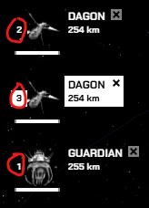
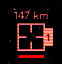

V tomto stave loď síce naďalej považuje ciele 1 a 2 za zamerané, no sú **neaktívne**, čo znamená, že palubné zbrane ich v danej chvíli **ignorujú**. Jediný cieľ, ktorý je zameraný, aktívny a zbrane po ňom pália, je cieľ č. 3.

Týmto spôsobom môžeme mať stále zameraných viacero cieľov, pričom zbrane sa sústredia vždy len na jeden, prípadne niekoľko málo z nich.

---

## Príklady taktiky boja

### Sledovanie zdravia lode

Toto je **veľmi** dôležitý bod, ktorý je nutné mať na mysli pri akomkoľvek boji. Počas boja musíš **neustále** sledovať zdravie lode, pretože strata *jediného* modulu znamená stratu *celej lode vrátane nákladu a astronautov*!!

V taktickom pohľade je nad každým modulom biely pásik, ktorý reprezentuje jeho zdravie:

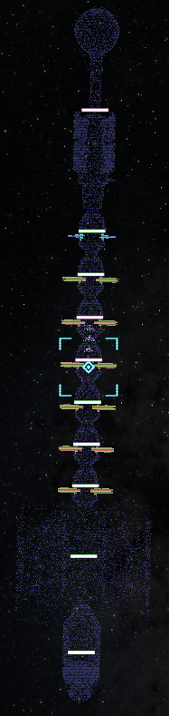

Tu sú všetky moduly v plnom zdraví, pásiky sú plné a biele.

Akonáhle sa niektoré moduly poškodia, biely pásik sa začne zmenšovať. Pri ešte väčšom poškodení sa pásik zafarbí *na žlto* a to je signál na použitie karty na opravu lode alebo **okamžitý únik** smerom domov. Na stanici sa vieš opraviť, vrátiť sa späť a nepriateľa v kľude doraziť. Posledné štádium zdravia je *červený pásik*, kedy už naozaj hrozí veľmi skoré zničenie lode!

### Raid / nájazd Impov

Na náhodne vybrané stanice hra generuje tzv. nájazdy, čo bývajú väčšinou desiatky Impov, ktorí sa pomaly presúvajú k stanici. Takáto skupina je pomerne ľahký cieľ a možnosť zarobiť nejakú biomasu.

1. Nájdi stanicu, na ktorú sa chystá nájazd pozostávajúci **iba** z Impov (ak si člen v zóne, máš prehľad na ľavej strane obrazovky):

   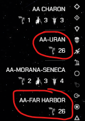

2. Cez stázovú kartu sa presuň na danú stanicu.
3. Na radare nájdi skupinu Impov.
4. Daj priblíženie na cca. 35km.
5. Počas rozbehu prepni všetky zbrane na automatický režim (vrátane Gatlingov, pretože Impy rakety určite strieľať nebudú!).
6. Po prílete na miesto pomocou klávesy `V` odleť cca. 10–15km vpravo alebo vľavo.
7. Akonáhle zastavíš a prvé Impy sú bližšie ako 20km, začni stláčať klávesu `N` a z času na čas kolieskom myši klikni na niektorú zo zbraní (Impy sú v pohybe, takže je nutné loď pomaly otáčať).
8. Ak ich nestihneš vyzabíjať, kým letia okolo teba, pomocou klávesy `V` ich predbehni, pričom budeš letieť paralelne s nimi vo vzdialenosti cca. 10–12km. Aj počas tohto letu sa otoč klávesou `Z` tak, aby ich tvoje zbrane vedeli zamerať a postupne likvidovať.
9. Keď ostaneš na bojisku sám, zavolaj svoju nákladnú loď a pomocou magnetronu si vyzbieraj materiál na biomasu.

### Osamotený Strážca

Osamotený [Strážca](https://source.outspacegame.com/cs/svet/zlo/list/8/) je zo začiatku výzva, ale po niekoľkých pokusoch to začne byť pomerne jednoduché. Strážca má pomerne veľa zdravia (asi 3000 HP), takže zdolať ho môže trvať dlhé minúty. Na začiatku, keď som mal loď osadenú len 3 či 4 platformami, som so Strážcami bojoval aj 20 minút.

Špecifikum Strážcu je to, že okrem *rakiet* vypúšťa aj *Svetlušky (Fireflies)*. Rakiet sa báť nemusíš, na to máme na lodi Gatling prepnutý do C-M režimu. Svetlušky sú horšie. Ihneď po vypustení fungujú skoro ako klasický nepriateľ, dajú sa zamerať a zostreliť palubnými zbraňami, avšak na rozdiel od iných nepriateľov letia priamo na tvoju loď!!

Akonáhle zbadáš, že Strážca vypustil Svetlušky, musíš útočiť primárne na ne (čítaj ďalej). Ak Svetlušky nezničíš, v blízkosti lode (cca. 5km) sa premenia na štandardné rakety, ktoré by mali vedieť tvoje Gatlingy zlikvidovať. Problém je, že Strážca vypustí naraz 1–3 Svetlušky a tvoj Gatling ich nestihne zostreliť všetky. Rakety zo Svetlušiek sú pomerne silné, a preto sa snaž ich zostreliť ešte kým sú relatívne ďaleko od lode.

Postup:

1. Presvedč sa, že Strážca je sám a v okolí min. 300km sa nenachádza iný nepriateľ.
2. Prílet ku Strážcovi naplánuj na cca. 15–20km od neho.
3. Gatlingy v C-M režime.
4. Ak si doletel na výrazne inú vzdialenosť, radšej sa vráť a skús to znova.
5. Okamžite po prílete zameraj Strážcu, otoč loď a začni páliť všetkým, čo na lodi máš.
6. S hrôzou sleduj, ako pomaly mu ubúda zdravie.
7. A teraz pozor – ak vypustí Svetlušky (zbadáš to priamo v hre v taktickom pohľade aj na radare – preto ho musíš neustále sledovať), rýchlo urob nasledovné:
   - stlač klávesu `N`, čím zameriaš niektoré Svetlušky (pravdepodobne nie všetky),
   - *odznač* Strážcu (ale ponechaj ho ako zameraný cieľ) – je to preto, aby sa zbrane venovali Svetluškám a nie Strážcovi,
   - akonáhle padne prvá Svetluška, mačkaj znova `N`, aby si označil ďalšie Svetlušky,
   - toto opakuj, kým sú na bojisku nejaké Svetlušky,
   - akonáhle ostane Strážca sám, znova ho *označ* a páľ všetkými zbraňami.
8. **Počas celého boja sleduj zdravie lode** a v prípade žltého modulu nie je hanba utiecť, opraviť sa a znova sa vrátiť!!
9. Po úspešnom zdolaní Strážcu nezabudni prísť s loďou s namontovaným [zberným zariadením](https://source.outspacegame.com/cs/kosmicka-lod/moduly/list/36/) a z tela Strážcu vydolovať nejaké vzácne suroviny!

### Strážca s ochranou

Po niekoľkých zdolaných Strážcoch budeš mať chuť „na niečo väčšie“. Bohužiaľ, Strážca je najväčšie zlo, ktoré vieš v začiatkoch zdolať sám a „za ním“ už je len [Leviatan](https://source.outspacegame.com/cs/svet/zlo/list/20/). Ten je pravdepodobne nad tvoje sily. Ale aj tak si vieš dopriať „trochu adrenalínu“ v podobe Strážcu s ochranou. Sú to malé zoskupenia jedného alebo viacerých Strážcov, ktorí majú pri sebe menšie typy Zla ako napr. Démonov, Dagonov, prípadne Golemov.

Taktika boja voči takýmto skupinám sa v zásade nelíši od boja proti jednému Strážcovi. Nepríjemné je, ak sa ocitneš uprostred krížovej paľby (hlavne rakety) z viacerých strán. Moje rady pre túto situáciu:

- Primárne zabíjaj všetko menšie ako Strážca, tých si nechaj na koniec.
- Strážcov (ak ich je viac) je dobré mať „na jednej strane lode“ a páliť vždy len po jednom z nich.
- Nebezpečné jednotky (Strážcovia a Golemy), ktoré vedia strieľať rakety, sa snaž mať stále zamerané (aj keď neoznačené). Akonáhle niektorý z nich vystrelí raketu, vieš si tohto jedného nepriateľa *označiť*, ostatných dočasne *odznačiť* a kliknutím kolieska myšky na niektorú zo zbraní sa bleskovo natočiť do smeru letiacej rakety. Tým výrazne uľahčíš prácu Gatlingom. Po zlikvidovaní rakety môžeš označenie cieľa vrátiť späť a venovať sa inému cieľu.
